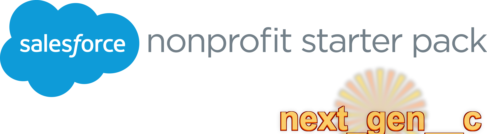

# NPSP_nextgen

## An LLM-Assisted Community Fork of the Nonprofit Success Pack

**NPSP_nextgen** is a community-driven fork of Salesforce's Nonprofit Success Pack (NPSP), enhanced and maintained with the assistance of large language models (LLMs). This project aims to bring continued support, bug fixes, and modern Salesforce standards to the many nonprofit organizations that continue to rely on NPSP.

---

## Important Disclaimers

### This Project is Provided "AS-IS"

**NPSP_nextgen IS NOT SPONSORED, ENDORSED, OR MAINTAINED BY SALESFORCE OR SALESFORCE.ORG.**

This is an independent community project. Use at your own risk.

- **No Warranty**: This software is provided "as is" without warranty of any kind, express or implied
- **No Support Guarantee**: Community support only - no SLAs or guaranteed response times
- **No Liability**: The maintainers assume no liability for any damages resulting from use of this software

### Always Test in a Sandbox First

**Before deploying ANY changes from this project to a production org:**

1. Deploy to a **full sandbox** or **developer sandbox** first
2. Thoroughly test all affected functionality
3. Verify data integrity and business processes
4. Have a rollback plan ready
5. Only then consider deploying to production

**We cannot stress this enough: TEST EVERYTHING IN A SANDBOX FIRST.**

---

## Why NPSP_nextgen?

With Salesforce's focus shifting to Nonprofit Cloud, many organizations on NPSP face uncertainty:

- **Continued NPSP Usage**: Thousands of nonprofits continue to rely on NPSP and may not be ready or able to migrate to Nonprofit Cloud
- **Modernization Gap**: NPSP contains legacy patterns (Visualforce, Aura, older Apex conventions) that could benefit from modernization
- **Community Support**: This project provides a path for community-driven improvements and bug fixes
- **Modern Standards**: Bringing NPSP closer to current Salesforce development best practices

### Goals

1. **Maintain Compatibility**: Keep NPSP functional on current Salesforce releases
2. **Fix Bugs**: Address issues that may not be prioritized in the official package
3. **Modernize Code**: Gradually update legacy patterns to modern standards (LWC, proper security patterns, etc.)
4. **Improve Documentation**: Better documentation for admins and developers
5. **Community Collaboration**: Open contribution model for the nonprofit Salesforce community

---

## Modernization Roadmap

We're executing a comprehensive modernization plan across **8 quarterly releases** (Q1 2026 - Q4 2027). All changes are designed to be **backwards compatible** for existing orgs.

### Release Schedule

| Release | Target | Focus Areas | Status |
|---------|--------|-------------|--------|
| **v1.0** | Q1 2026 | Foundation + Critical Security | Planning |
| **v1.1** | Q2 2026 | Security Hardening | Planning |
| **v1.2** | Q3 2026 | Async Apex Modernization | Planning |
| **v1.3** | Q4 2026 | Performance Optimization | Planning |
| **v2.0** | Q1 2027 | Code Quality Standards | Planning |
| **v2.1** | Q2 2027 | UI Modernization (Aura → LWC) | Planning |
| **v2.2** | Q3 2027 | Configuration + Accessibility | Planning |
| **v2.3** | Q4 2027 | Integration + Final Polish | Planning |

### Key Modernization Areas

| Area | Current State | Target | Items |
|------|---------------|--------|-------|
| **API Version** | 53.0 (Winter '22) | 60.0+ | 1 |
| **@future → Queueable** | 13 legacy methods | Modern async | 13 |
| **Batch Apex** | 45 classes | Finalizer pattern | 45 |
| **Custom Settings → CMT** | 14 settings | Deployable metadata | 14 |
| **Aura → LWC** | 35 components | Modern UI | 35 |
| **Visualforce** | 79 pages | LWC (long-term) | 79 |
| **Security** | Gaps identified | Full CRUD/FLS | 30+ |
| **Governor Limits** | 23 issues | Optimized | 23 |

### Progress Tracking

**154 total items** identified | **0 completed** | **154 remaining**

See [documentation/MODERNIZATION_BURNDOWN.md](documentation/MODERNIZATION_BURNDOWN.md) for the complete burndown list with detailed tasks, file references, and implementation guidance.

---

## LLM-Assisted Development

This project leverages AI/LLM assistance for:

- **Code Analysis**: Automated codebase review and pattern detection
- **Documentation**: Generating and maintaining technical documentation
- **Issue Triage**: Automated routing of issues to appropriate domain areas
- **Code Review**: AI-assisted review of pull requests
- **Test Generation**: Assistance in creating comprehensive test coverage

The multi-agent system includes specialized agents for:
- Apex backend development
- Lightning Web Components
- Testing and quality assurance
- Security review
- DevOps and CI/CD
- Documentation

See `.claude/agents/ARCHITECTURE.md` for details on the agent system.

---

## Installation

### For Evaluation/Development

```bash
# Clone the repository
git clone https://github.com/tbcolby/NPSP_nextgen.git
cd NPSP_nextgen

# Install dependencies
yarn install

# Set up CumulusCI (if not already installed)
pip install cumulusci

# Create a scratch org for testing
cci org scratch dev my_dev_org

# Deploy and configure
cci flow run dev_org --org my_dev_org
```

### For Production Use

**Remember: Always test in a sandbox first!**

This project is intended primarily for:
- Development and testing
- Evaluation of improvements
- Contributing back to the community

If you choose to use in production, you assume all responsibility for testing and validation.

---

## Contributing

We welcome contributions from the community! Please see [CONTRIBUTING.md](CONTRIBUTING.md) for guidelines.

### Ways to Contribute

- **Report Issues**: Use our issue templates for bugs, features, and security reports
- **Submit PRs**: Code contributions are welcome
- **Documentation**: Help improve docs and guides
- **Testing**: Help test changes in different org configurations
- **Feedback**: Share your experience and suggestions

---

## Project Structure

```
NPSP_nextgen/
├── force-app/              # Main Salesforce source code
│   ├── main/              # Core NPSP functionality
│   ├── infrastructure/    # fflib framework
│   └── tdtm/              # Trigger framework
├── .claude/agents/        # LLM agent configurations
├── .github/               # GitHub workflows and templates
├── robot/                 # Robot Framework tests
└── documentation/         # Project documentation
```

---

## Resources

### Original NPSP Resources
- [NPSP Documentation](https://help.salesforce.com/s/articleView?id=sfdo.Nonprofit_Success_Pack.htm)
- [Original NPSP Repository](https://github.com/SalesforceFoundation/NPSP)

### Community
- [Nonprofit Hub (Trailblazer Community)](https://trailhead.salesforce.com/trailblazer-community/groups/0F9300000001ocxCAA)
- [Power of Us Hub](https://powerofus.force.com/)

---

## License

This project is licensed under the BSD-3 Clause License - see the [LICENSE](LICENSE) file for details.

The original Nonprofit Success Pack is open-source software licensed by Salesforce.org under the BSD-3 Clause License.

---

## Disclaimer (Full)

NPSP_NEXTGEN IS AN INDEPENDENT COMMUNITY PROJECT AND IS NOT AFFILIATED WITH, SPONSORED BY, OR ENDORSED BY SALESFORCE, INC. OR SALESFORCE.ORG.

THIS SOFTWARE IS PROVIDED "AS IS" AND ANY EXPRESS OR IMPLIED WARRANTIES, INCLUDING, BUT NOT LIMITED TO, THE IMPLIED WARRANTIES OF MERCHANTABILITY AND FITNESS FOR A PARTICULAR PURPOSE ARE DISCLAIMED. IN NO EVENT SHALL THE COPYRIGHT HOLDER OR CONTRIBUTORS BE LIABLE FOR ANY DIRECT, INDIRECT, INCIDENTAL, SPECIAL, EXEMPLARY, OR CONSEQUENTIAL DAMAGES (INCLUDING, BUT NOT LIMITED TO, PROCUREMENT OF SUBSTITUTE GOODS OR SERVICES; LOSS OF USE, DATA, OR PROFITS; OR BUSINESS INTERRUPTION) HOWEVER CAUSED AND ON ANY THEORY OF LIABILITY, WHETHER IN CONTRACT, STRICT LIABILITY, OR TORT (INCLUDING NEGLIGENCE OR OTHERWISE) ARISING IN ANY WAY OUT OF THE USE OF THIS SOFTWARE, EVEN IF ADVISED OF THE POSSIBILITY OF SUCH DAMAGE.

**ALWAYS TEST ALL CHANGES IN A SANDBOX ENVIRONMENT BEFORE DEPLOYING TO PRODUCTION.**
